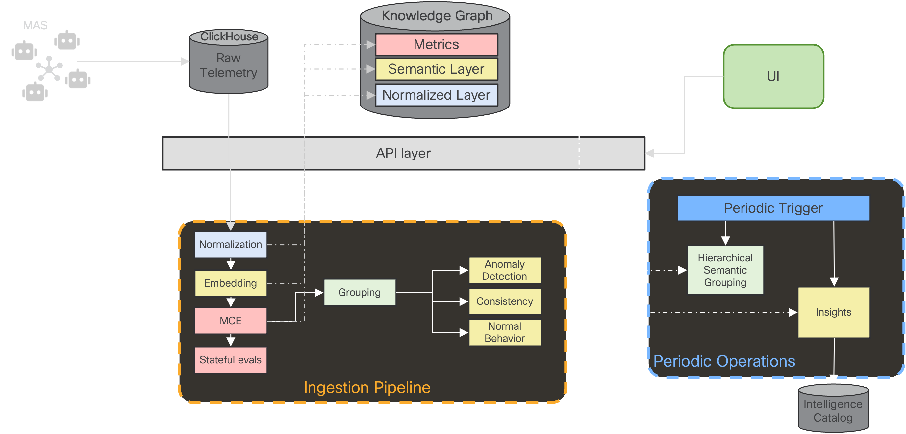

# Architecture Overview

The picture belows depicts the overall architecture of OXP.

The OTel spans emitted by the MAS are stored in a ClickHouse DB.
Once the session is finished, the ingestion pipeline is triggered:

1. The normalization worker is triggered, transforming OTel spans into a normalized trace stored in the knowledge graph, following our MAS execution ontology.
2. The embedding worker is triggered afterwards, to compute for each state in the trajectory the associated embedded vector.
3. The MCE worker is also triggered, to compute a set of pre-defined metrics for the session.
The set of metrics is configurable, see the MCE documentation for more information.
4. The grouping worker is triggered next.
Using the embeddings computed earlier, the session is assigned to a semantic group if possible.
See the semantic grouping documentation for more information.
5. If the session is attached to a semantic group, the computation for anomaly detection, consistency and normal behavior is triggered.

**Note**: the analysis library actually encompasses the grouping, anomaly detection, consistency and normal behavior.

In addition to the ingestion pipeline, which is running every time a session completes, additional operations are running periodically.
Those are workers that are triggered regularly:
* The hierarchical semantic grouping worker is responsible for creating the different semantic groups for the MAS sessions.
Eventually re-arranging them when new sessions arrive.
See the semantic grouping documentation for more information.
* The insights worker is creating insights based on the data stored in the knowledge graph.
See the insights documentation for more information.

The pipelines, both ingestion and periodic, are modular; thus easily allowing for new workers, to compute additional features for the analysis.
See the pipelines [documentation](./pipelines.md) for more information.
