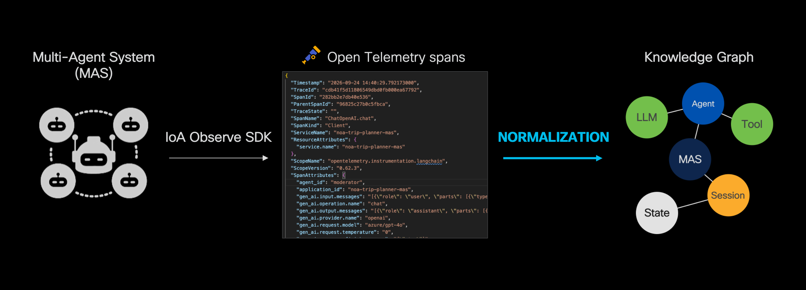

# Normalization

The normalization library (`norm`) is the component that parses raw OpenTelemetry spans into ontology-backed knowledge graph data (`{"nodes": [...], "edges": [...]}`), which conforms to the [OXP ontology](https://cisco-eti.github.io/oxp-ontology/).

**Source:** [`norm`](https://github.com/outshift-open/observe-and-explain-platform/tree/main/backend/norm)

## Overview

`norm` is the normalization layer that sits between raw OTel traces and the knowledge graph. It takes the spans an agentic system emits through instrumentation and turns them into the nodes and edges that get written to the graph database.

The normalized data is made up of:
- the structural identities (multi-agent system/agent/tool/model)
- the execution hierarchy (the session execution, who called what)
- the trajectory (what content actually flowed through the system)

These elements correspond respectively to the `StructuralElement`, `ExecutionElement`, and `TrajectoryElement` in the OXP ontology. 

The normalization library simply contains the span data extraction, with no I/O beyond optional file loading: it does not fetch spans itself, does not talk to the graph database, and does not run as a service. [norm-worker](https://github.com/outshift-open/observe-and-explain-platform/tree/main/backend/workers/norm-worker) is the production caller — it fetches spans through the API client, adapts them to the raw span-dict shape `norm` expects, calls `normalize()`, and writes the result to the graph.

## Design principles

The normalization implementation follows the following principles:

1. Every span is dispatched straight to individual handlers based on their `SpanName`, which create/update a corresponding set of nodes and edges in the knowledge graph.
2. To ensure sanity of the resulting graph, every generated node/edge is validated as an object from the OXP ontology.
3. A set of post-processing steps ensure the eventual sanity of the resulting graph, mostly reconciling the trajectory after every span was processed by its handler.

### Structure 

The main entrypoint for the library is `norm.normalize(spans: dict[str, any])` &rarr; `(nodes, edges)`. The processing operates in two phases:
1. **Dispatch** spans to individual handlers to generate base nodes and edges
2. **Post-processing** step through a set of heuristics reconciling the trajectory

### 1. Dispatch — one pass over the spans

| `SpanName` | Handler | Produces |
|------------|---------|----------|
| `session.start` | `handle_session_start` | `Session`, `MAS` (if `application_id` present) |
| `session.end` | `handle_session_end` | Updates the existing `Session`'s `endTime`/`duration`/`success` |
| `*.graph` | `handle_graph` | Declared `MAS`/`Agent`/`Tool` nodes — the one authoritative source of "declared" structural data |
| `*.agent` | `handle_agent` | `Agent` (undeclared placeholder if not already declared), `AgentCall`, its own State pair |
| `*.chat` | `handle_chat` | `LLM`, `LLMCall` (token counts, temperature, finish reason), its own State pair (including system-instruction content, folded into the initial State) |
| `*.tool` | `handle_tool` | `Tool`, `ToolCall`, its own State pair |

### 2. Post-processing — four best-effort passes, in order, each over the full registry

1. **`link_agent_handoffs`** — for each `*.agent` span carrying an explicit `ioa_observe.handoff.source.span_ids` signal, bridges the named predecessor `AgentCall`'s final State against the successor's initial State.
2. **`chain_agent_handoffs_fallback`** — for sibling `AgentCall`s under one `MASCall` that got no explicit handoff signal at all, sorts them by `startTime` and bridges consecutive pairs — same fallback rationale as step 3, and correctly excludes a sub-agent call nested inside a sibling's own span (detected via `parentSpanId`) so a containment relationship never gets misread as a handoff.
3. **`chain_capability_calls`** — no SDK signal orders sibling `LLMCall`/`ToolCall`s within one `AgentCall`, so this sorts them by `startTime` as a deliberate, documented fallback and bridges consecutive siblings whose content doesn't already line up.
4. **`assign_container_boundary_states`** — `MASCall`/`Session` adopt their earliest/latest child's boundary State directly (see "bridge vs. share" above).

## Further reading

For further implementation details, see internal documentation under `norm/docs/`:

- [README](https://github.com/cisco-eti/claris-lib/blob/main/norm/README.md) — quick start, public API, ontology conformance
- [User guide](https://github.com/cisco-eti/claris-lib/blob/main/norm/docs/user-guide.md) — inputs, `normalize()`, validation reports
- [Normalization pipeline](https://github.com/cisco-eti/claris-lib/blob/main/norm/docs/normalization.md) — full dispatch table and post-processing passes
- [Code structure](https://github.com/cisco-eti/claris-lib/blob/main/norm/docs/code-structure.md) — module map
- [Developer guide](https://github.com/cisco-eti/claris-lib/blob/main/norm/docs/developer-guide.md) — adding a handler or heuristic

