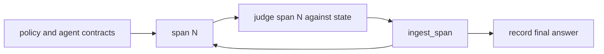
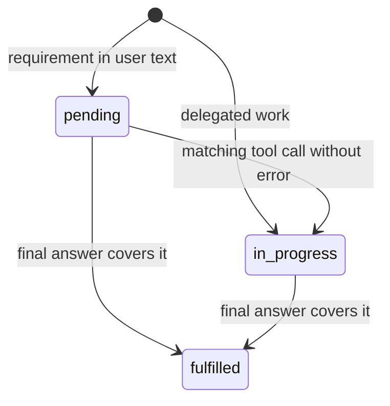

# Trajectory Context

`TrajectoryContext` (`trajectory_context.py`) is the state Stateful Evals builds
while it reads a trajectory: what the policy and user said, what tools returned,
what agents claimed, which requirements are still open, and how agents
coordinated. This page lists the artifacts it records, their main properties,
and how they change span by span.

**Related pages**

- [Stateful Evals](../../README.md): running evaluations
- [Quick start](../../quickstart/README.md): build a context from a real trajectory
- [Defining Evaluation Metrics](trajectory_context_metrics/README.md): metrics that read this state

## How it is built

One context is created per trajectory. `TemporalMetricsProcessor` sorts and
de-duplicates the spans, extracts the policy, tool definitions, and agent
contracts, then walks the spans in start-time order. Each span is judged against
the state built from earlier spans, then ingested. After the last span, the final
answer is recorded.



All state is written by deterministic code in `trajectory_context.py`. No LLM
output is written back into it.

## Artifacts

| Store | Type | ID | Holds |
| --- | --- | --- | --- |
| `evidence` | `EvidenceFact` | `policy:root`, `semantic_contract:<agent>`, `user:N`, `fact:N` | Policy, agent contracts, user messages, tool outputs, handoff messages |
| `intents` | `IntentEntry` | `intent:N` | Requirements taken from user text, and delegated work |
| `claims` | `ClaimEntry` | `claim:N` | What agents said and what tools returned |
| `coordination_events` | `CoordinationEvent` | `coordination:N` | Assignment, handoff, verification, synthesis, and similar acts |
| `provenance_links` | `ArtifactProvenanceLink` | none | Typed edges between artifact IDs |

Shared state: `policy_text`, `tool_definitions`, `latest_root_answer` and
`latest_root_answer_span_index` (cited as `final_answer`), `root_agent_id`,
`coordination_metadata`, and `coordination_context` (the adapter sidecar, see
`coordination.py`).

## Key properties

**`EvidenceFact`**: `span_index`, `fact_type` (`policy_rule`, `user_statement`,
`tool_output`, `agent_handoff`, `environment_context`, `runtime_feedback`),
`content`, `source_name`, `agent_id`, `actor_scope`, span identity (`span_id`,
`parent_span_id`, `trace_id`), and `related_intent_ids`.

**`IntentEntry`**: `name`, `description`, `source` (`user`, `policy`,
`agent_plan`), `requirement_type`, `status`, `first_seen`, `last_seen`,
`owner_agent_ids`, `assigned_by_agent_id`, `parent_intent_ids`,
`dependency_intent_ids`, and an append-only `events` list (`tool_attempt`,
`assignment`, `final_answer_alignment`, ...).

**`ClaimEntry`**: `claim_type` (`assertion`, `peer_agent_assertion`,
`completion_claim`, `tool_result`), `content`, `entity_name`, `agent_id`,
`evidence_refs`, and `revision_of_claim_id` when it revises an earlier claim.

**`CoordinationEvent`**: `event_type` (`assignment`, `handoff`, `peer_message`,
`revision`, `verification`, `selection`, `commit`, `synthesis`), `actor_agent_id`,
`sender_agent_ids`, `recipient_agent_ids`, `input_artifact_ids`,
`output_artifact_ids`, and `status`.

**`ArtifactProvenanceLink`**: `source_artifact_id`, `target_artifact_id`, and
`relation_type` (`advances`, `decomposes_to`, `final_answer`, `informs`,
`precedes`, `produces`, `revised_by`, `supports`).

## Intent lifecycle

An intent starts `pending`, or `in_progress` for delegated work. It becomes
`in_progress` when a tool call that did not error matches it, and `fulfilled`
when the final answer covers it. Status never moves backwards. `dropped` is
declared but no code sets it.



## Example

This runs as-is and makes no model calls:

```python
from stateful_evals_be.evaluation.trajectory_context import TrajectoryContext


def llm(agent, *, user="", output="", tools=()):
    calls = [{"id": f"call-{t}", "function": {"name": t, "arguments": "{}"}} for t in tools]
    messages = [{"role": "user", "content": user}] if user else []
    return {"entity_type": "llm", "entity_name": "chat", "agent_id": agent,
            "input_payload": {"messages": messages},
            "output_payload": {"content": output, "tool_calls": calls}}


def tool(name, output, *, agent="", task=""):
    return {"entity_type": "tool", "entity_name": name, "agent_id": agent,
            "input_payload": {"task": task} if task else {}, "output_payload": output}


spans = [
    llm("moderator", user="Plan a weekend trip to Lisbon with a budget of $500.",
        output="Let me search trains first.", tools=["search_trains"]),
    tool("search_trains", {"trains": [{"id": "CV103", "departs": "09:10", "fare_eur": 42}]}),
    llm("moderator", output="Here is your Lisbon weekend plan: take train CV103 on Saturday at "
                            "09:10 for EUR 42, which keeps the trip well under your $500 budget."),
]

context = TrajectoryContext(policy_text="")
for index, span in enumerate(spans):
    before = {i.name: i.status for i in context.intents}
    context.ingest_span({**span, "span_id": f"s{index}"}, span_index=index)
    changes = {i.name: i.status for i in context.intents if before.get(i.name) != i.status}
    print(f"span {index}: facts={len(context.evidence)} claims={len(context.claims)} intent changes={changes}")

print("evidence:", [(i, f.fact_type, f.source_name) for i, f in enumerate(context.evidence)])
print("claims:  ", [(i, c.claim_type) for i, c in enumerate(context.claims)])
print("final answer:", context.get_final_answer_context()["final_answer"][:60], "...")
```

```text
span 0: facts=1 claims=1 intent changes={'Trip itinerary': 'pending', 'Budget ceiling': 'pending'}
span 1: facts=2 claims=2 intent changes={'Trip itinerary': 'in_progress', 'Budget ceiling': 'in_progress'}
span 2: facts=2 claims=3 intent changes={'Trip itinerary': 'fulfilled', 'Budget ceiling': 'fulfilled'}
evidence: [(0, 'user_statement', 'user'), (1, 'tool_output', 'search_trains')]
claims:   [(0, 'assertion'), (1, 'tool_result'), (2, 'assertion')]
final answer: Here is your Lisbon weekend plan: take train CV103 on Saturd ...
```

What each span changed:

| Span | What happened | State change |
| --- | --- | --- |
| 0 | User request; the model plans and calls a tool | evidence 0 (`user_statement`) recorded; requirements `Trip itinerary` and `Budget ceiling` extracted as `pending`; claim 0 (assertion) |
| 1 | `search_trains` returns | evidence 1 (`tool_output`) and claim 1 (`tool_result`); both intents match the tool activity and move to `in_progress` |
| 2 | The model gives the plan | Claim 2; it is the root answer and covers both requirements, so both intents become `fulfilled` |

To build a context from a real trajectory file, run the
[quick start](../../quickstart/README.md). Its `inspect_trajectory.py` prints the
same summary for a NOA trip planner run.

## Saving and loading

`trajectory_context_metrics/context_io.py` writes and reads the full context as
JSON, without shortening any value:

```python
from stateful_evals_be.evaluation.trajectory_context_metrics.context_io import (
    load_trajectory_context_artifact,
    trajectory_context_to_payload,
)

payload = trajectory_context_to_payload(context, schema_version="v1", session_id="example")
restored, metadata = load_trajectory_context_artifact("trajectory_context.json")
```

The payload has `schema_version`, `session_id`, `policy_text`, one key per store
(`evidence`, `intents`, `claims`, `coordination_events`, `provenance_links`),
`coordination_metadata`, `final_answer_context`, and `coordination_context`.

## Reading state

- The per-span judge reads `retrieve_for_state_delta(span)`, a bounded view of
  the facts, intents, and claims relevant to the current span.
- Trajectory metrics read `build_context_payload(...)`. See
  [Defining Evaluation Metrics](trajectory_context_metrics/README.md#metric-inputs).
