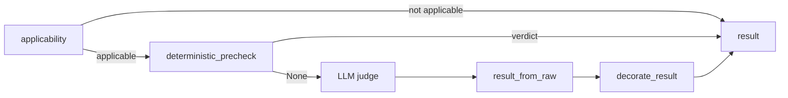

# Defining Evaluation Metrics

Trajectory metrics are binary checks judged over a finished
[`TrajectoryContext`](../README.md). Each metric is a rubric plus a
selection of context components: an LLM judge reads the rubric and the selected
state and returns pass or fail with evidence. This page shows how to write,
register, select, and test one.

**Related pages**

- [Stateful Evals](../../../README.md): running evaluations and selecting metrics
- [Trajectory Context](../README.md): the artifacts a metric can read

## How a metric runs



Most metrics share one batched judge call per trajectory. Metrics with
`requires_dedicated_judge = True` get their own call, with the payload built by
their `to_judge_payload`.

## Write a metric

Subclass `TrajectoryMetric`, give it a name, a stable code, a rubric, and the
components it reads:

```python
from stateful_evals_be.evaluation.trajectory_context_metrics import metric_input_config
from stateful_evals_be.evaluation.trajectory_context_metrics.trajectory_metrics import TrajectoryMetric


class RetryDisciplineMetric(TrajectoryMetric):
    """Checks that failed work is retried only when the retry can succeed."""

    name = "Retry Discipline"
    metric_code = "retry_discipline"
    metric_layer = "execution"
    rubric = """\
Evaluate whether the orchestrator retries failed work sensibly.

Use coordination_summary.exact_repeated_call_groups and delegation_audit.
Pass when each retry follows a failure and changes something
(input, recipient, or timing), or when the policy requires the retry. Fail when
the same call is repeated after a failure with nothing changed, three or more
times. Cite the repeated calls.

Do not fail for a single retry after a transient error; that is expected.
"""

    def __init__(self, *, input_config=None, judge=None):
        super().__init__(
            input_config=input_config or metric_input_config("policy", "operations"),
            judge=judge,
        )
```

## Metric inputs

`metric_input_config(*components, max_claims=None, max_facts=None)` picks what
the judge sees. `coordination_context` (topology diagnostics) is always included.

| Component | Adds to the judge payload |
| --- | --- |
| `policy` | `policy` (root policy, `policy:root`) and `semantic_contracts` (one per agent, `semantic_contract:<agent>`) |
| `user_statements` | `user_statements` (`user:N`) |
| `fact_store` | `fact_store`: tool outputs and other non-policy facts (`fact:N`) |
| `intents` | `intents` with status, owners, and compacted events (`intent:N`) |
| `claims` | `claims` (`claim:N`), including the root agent's final answer |
| `final_answer` | `final_answer` and its span index |
| `operations` | `operations` (actor-scoped operation history), `coordination_summary` (including `exact_repeated_call_groups`), `work_ledger`, `coordination_events`, `provenance_links`, `delegation_audit`, `delegation_summary` |
| `coordination` | Accepted; adds nothing beyond `coordination_context` |

`max_claims` and `max_facts` keep the most recent items. Every item carries an
`artifact_id`; judges cite those IDs and the evaluator resolves them to evidence.
[Trajectory Context](../README.md#artifacts) describes each artifact.

## Writing the rubric

- State the construct in one sentence, then the pass and fail conditions.
- Say what does not count, especially failures that belong to another metric.
- Say what a fatal finding must cite (for example the request and the handoff).
- Name the payload fields to use when a metric depends on a specific view.

The judge's system prompt already requires strict JSON, a fatal failure for any
score of 0, and credit for issues that were fully recovered.

## Design rules

- **Prefer letting the judge interpret text.** Select inputs structurally, by
  state type or field, and put the meaning in the rubric. Word lists, keyword
  regexes, and phrase checks in metric code are brittle and hide the decision
  from the rubric. Parsing machine formats is fine: artifact IDs, JSON, the
  `[Tool: x] Called with / Returned` wrapper, and metric codes.
- **Keep prechecks structural.** A `deterministic_precheck` should decide only
  from state such as intent status. Some registered metrics still override it
  (`policy_safety`, `instruction_following`, `semantic_consistency`,
  `verification_quality`, `communication_efficiency`, `groundedness`); new metrics
  should not rely on text matching there.
- **Scores need evidence.** A score of 0 without a fatal failure is normalized
  to 1.

## Optional hooks

| Attribute or method | Use it to |
| --- | --- |
| `applicability(context)` | Return `not_applicable` when the trajectory structurally lacks what the metric measures |
| `deterministic_precheck(context)` | Return a zero-token verdict from structural state, or `None` |
| `requires_dedicated_judge = True` + `to_judge_payload(context)` | Build a focused payload and judge the metric in its own call |
| `result_from_raw(raw, judge=...)` | Post-process the judge's JSON |
| `result_metadata(context)` | Attach deterministic diagnostics to every verdict |
| `affects_trajectory_score` | Keep `False`; trajectory metrics are diagnostic |

## Results

Each metric returns a `HighLevelMetricResult`:

| Field | Meaning |
| --- | --- |
| `status` | `pass`, `fail`, `not_applicable`, or `unknown` (judge output was invalid) |
| `score` | `1`, `0`, or `None` when not applicable or unknown |
| `reasoning` | The judge's short explanation |
| `fatal_failures`, `minor_failures` | `HighLevelMetricFailure` items with span index, impact, and `EvidenceRef` evidence |
| `metadata` | Metric code, input config, token usage, applicability, and hook diagnostics |

Exclude `None` scores from pass rates.

## Register and select

Add a `TrajectoryMetricDefinition(code, name, layer, implementation)` to
`TRAJECTORY_METRIC_DEFINITIONS` in `trajectory_metrics.py`. Callers then select
it by code:

```python
from stateful_evals_be import TemporalMetricOptions

options = TemporalMetricOptions(trajectory_metrics=["retry_discipline", "groundedness"])
```

Or run it on a saved context with
`evaluate_trajectory_metrics_batched(context, ["retry_discipline"])`.
`["all"]` selects every registered metric. To try metrics on real data, select
them with `trajectory_metrics` when you evaluate the bundled NOA trip planner
trajectory from the [quickstart](../../../quickstart/README.md).

## Test

Give the metric a fake judge; no model call is made:

```python
from stateful_evals_be.evaluation.trajectory_context import TrajectoryContext


class FakeJudge:
    last_usage = None

    def judge(self, *, metric_name, rubric, context_payload):
        assert "coordination_summary" in context_payload
        return {"score": 1, "reasoning": "One retry after a timeout.", "fatal_failures": []}


result = RetryDisciplineMetric(judge=FakeJudge()).evaluate(TrajectoryContext("Retry at most once."))
print(result.status, result.score)  # pass 1
```

To exercise the batched path, give the fake judge a `judge_batch` method; see
`stateful_evals_be/tests/test_trajectory_metric_suites.py`.

## Registered metrics

| Code | Layer | Judge call |
| --- | --- | --- |
| `policy_safety` | configuration | batched |
| `delegation_accuracy` | execution | dedicated (routing and ownership sub-audits) |
| `goal_alignment` | configuration | dedicated |
| `instruction_following` | execution | batched |
| `handoff_quality` | execution | batched |
| `semantic_consistency` | execution | batched |
| `context_preservation` | execution | batched |
| `confidence_calibration` | execution | batched |
| `verification_quality` | outcome | batched |
| `communication_efficiency` | execution | batched |
| `groundedness` | outcome | dedicated |
| `task_completion` | outcome | batched |
| `constraint_satisfaction` | outcome | batched |

Each class and rubric is in `trajectory_metric_definitions.py` and
`trajectory_metrics.py`. `available_trajectory_metrics()` returns this list.

`high_level_metric_suite` selects the metric set the final audit uses:
`legacy_v1` (the default), `paper_v1`, or `paper_v2` (the metrics above).
`scripts/compare_trajectory_metric_suites.py` re-scores a saved
`trajectory_context.json` with `legacy_v1`, `paper_v1`, or both.
