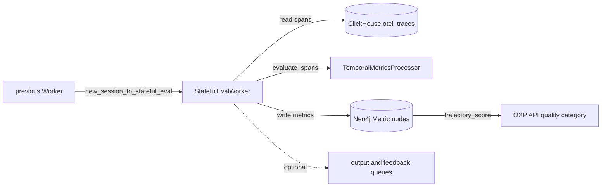

# Stateful Eval Worker

The Stateful Eval worker scores agent sessions with the
[Stateful Evals](../../stateful-evals/README.md) library. It takes a session ID
from a RabbitMQ queue, loads the session's spans from ClickHouse through the
OXP API library (`oxp.client.local.LocalClient`), and evaluates them in process
with `stateful_evals_be.TemporalMetricsProcessor`. It writes per-span
Groundedness, IntentRecognition, and Relevancy scores and a session
`trajectory_score` to the Neo4j knowledge graph, then forwards the message.
Evaluation makes model calls, which can cost money. The worker is built on the
[worker-base](../../worker-base/README.md) framework.

## Where it sits in OXP



The OXP API's `quality` category reads `trajectory_score` as a source of `MDT` (`trajectoryQuality`) in [`config.py`](../../api/oxp/core/config.py); no default
category lists the `mdt.*` span metrics.

## How it works

For each message, `StatefulEvalWorker.handle_message`:

1. Fetches every span of `session_id` with
   `stateful_evals_be.integrations.oxp.fetch_session_spans` (500 per page,
   oldest first, converted by `oxp_span_to_otel`).
2. Builds a new `TemporalMetricsProcessor` and calls
   `evaluate_spans(spans, session_id=...)`, the same processor that
   `stateful_evals_be.evaluate_spans` uses. No policy override is passed, so the
   policy is the system message found in the spans.
3. Writes the metrics to Neo4j when `PUSH_METRICS` is on and `result.error` is
   empty.
4. Publishes one output message to each output queue.

Fetching, evaluation, and metric writes run in threads. Up to
`MAX_INFLIGHT_MESSAGES` messages run at once and share one `LocalClient`. The
processor returns its errors in `result.error` (for example `No spans found for
session`); the worker then writes no metrics but still publishes. If fetching or
writing raises, the worker logs it, sends an `error` feedback event, and
publishes nothing. Either way the message is acknowledged, not requeued.

## Messages

| Direction | Queue | Payload |
| --- | --- | --- |
| Consumes | `new_session_to_stateful_eval` (durable) | `BaseQueueMessage`: `session_id` (required), `job_id`, `workflow_id`, `local_file` (passed through, not read). Other fields are ignored |
| Publishes | Each output queue; none by default | `BaseQueueMessage` with `job_id`, `workflow_id`, `local_file`, and `session_id` copied from the input |
| Feedback | Feedback queue; none by default | `session_id`, `event` (`start`, then `complete` or `error`), `workflow` (`StatefulEvalWorker`), `workflow_id`; `start` adds `input` and `queue_name` |

## What it writes

The worker only reads ClickHouse. It writes to Neo4j with
`LocalClient.write_span_metrics` and `write_session_metrics`.

| Metric | Attached to | Value |
| --- | --- | --- |
| `mdt.Groundedness`, `mdt.IntentRecognition`, `mdt.Relevancy` | `(:Session {sessionId})-[:hasSpan]->(:Span {spanId})`, created if missing | `0` or `1` per judged `llm` or `tool` span; `tool` spans get no Groundedness |
| `trajectory_score` | An existing `Session` node with that `sessionId`; nothing is written if there is none | `0` or `1`; `reasoning` is `trajectory_reasoning` |

Each metric is a `Metric` node linked by `hasMetric`, with `provider`
`stateful_evals`, `source` `StatefulEval`, `metricId` equal to the name, and
`reasoning`. It is matched on `metricName` and `resourceId`, so a re-run
overwrites it.

## Configuration

Flags override environment variables, except `MAX_INFLIGHT_MESSAGES`, which
overrides `--max-inflight-messages`. From a source checkout, `cli.py` also loads
`workers/stateful-eval-worker/.env`, without overriding variables already set.

| Variable | Flag | Default | Purpose |
| --- | --- | --- | --- |
| `RABBITMQ_URL` | `--rabbitmq-url` | none | Broker URL; this or the split variables are required, also with `--run-once` |
| `RABBITMQ_HOST`, `RABBITMQ_USER`, `RABBITMQ_PASSWORD`, `RABBITMQ_PORT`, `RABBITMQ_VHOST` | | none, none, none, `5672`, `/` | Alternative to `RABBITMQ_URL`; host, user, and password are required |
| `STATEFUL_EVAL_INPUT_QUEUE` | `--input-queue` | `new_session_to_stateful_eval` | Input queue (`queues.NEW_SESSION_TO_STATEFUL_EVAL_Q`) |
| `STATEFUL_EVAL_OUTPUT_QUEUE` | `--output-queue` (repeatable) | none | Output queues, comma-separated |
| `STATEFUL_EVAL_FEEDBACK_QUEUE` | `--feedback-queue` | none | Feedback queue |
| `MAX_INFLIGHT_MESSAGES` | `--max-inflight-messages` | `32` | Concurrent messages and prefetch count; `-1` uses the CPU count |
| `OPENAI_API_KEY` | `--llm-api-key` | empty | Model API key |
| `LLM_MODEL_NAME` | `--llm-model-name` | `gpt-4o` | Judge model |
| `LLM_BASE_MODEL_URL_MCE` | `--llm-base-model-url` | `https://api.openai.com/v1` | Model endpoint |
| `SAMPLING_STRATEGY`, `SAMPLING_EARLY_RATE`, `SAMPLING_MID_RATE` | | `none`, `0.25`, `0.60` | `tail_weighted` judges these shares of spans in the first 40% and the next 30%; the rest and anchor spans are always judged |
| `PUSH_METRICS` | | `true` | `false`, `0`, or `no` skips all Neo4j writes |
| `CLICKHOUSE_HOST`, `CLICKHOUSE_PORT`, `CLICKHOUSE_USERNAME`, `CLICKHOUSE_PASSWORD`, `CLICKHOUSE_DATABASE` | | `localhost`, `8123`, `admin`, `admin`, `default` | Span store |
| `NEO4J_HOST`, `NEO4J_PORT`, `NEO4J_USERNAME`, `NEO4J_PASSWORD`, `NEO4J_DATABASE` | | `localhost`, `7687`, `neo4j`, empty, `neo4j` | Knowledge graph, used when `PUSH_METRICS` is on. `NEO4J_AUTH=user/password` also sets the credentials |

ClickHouse and Neo4j values come from `oxp.core.config.settings` in the
[`api`](../../api/README.md) package. `LocalClient.from_settings` connects to
`bolt://<NEO4J_HOST>:<NEO4J_PORT>` unless `NEO4J_HOST` is a URI, so a bare host
must not include a port. The Neo4j connector that `BaseWorker` creates at
startup is not used here; if it fails, it only logs a warning.

## Run locally

From the repository root:

```bash
# Liveness check: prints "I'm Alive"
uv run --package stateful-eval-worker stateful-eval-worker-cli --test

# Queue mode
uv run --package stateful-eval-worker stateful-eval-worker-cli \
  --rabbitmq-url amqp://<user>:<password>@localhost:5672/ --output-queue <next-queue>

# Run-once mode (Argo Workflows): --input to --output, no broker connection
echo '{"session_id": "<session-id>"}' > /tmp/stateful-eval-input.json
uv run --package stateful-eval-worker stateful-eval-worker-cli --run-once \
  --rabbitmq-url amqp://<user>:<password>@localhost:5672/ \
  --input /tmp/stateful-eval-input.json --output /tmp/stateful-eval-output.json
```

`--run-once` writes `{"workflow_id": ..., "session_id": ...}` to `--output` and
generates `workflow_id` when the input has none. `--input` also accepts inline
JSON; a JSON array is processed as a batch and written as an array. In queue
mode, `--max-sessions N` processes at most N messages (`-1`, the default, means
no limit).

Both modes read spans from ClickHouse; the worker has no file input. To evaluate
the bundled NOA trip planner sample
[`trajectory_e7f32992.json`](../../stateful-evals/quickstart/data/trajectory_e7f32992.json)
without a database, use `stateful_evals_be.evaluate_file`, as the
[quickstart](../../stateful-evals/quickstart/README.md) does. The full NOA set is in
[claris-sandbox](https://github.com/cisco-eti/claris-sandbox/tree/main/stateful_evals/backend/data/trajectories/noa_trip_planner).

## Docker

Build from the repository root.

```bash
docker build -f workers/stateful-eval-worker/deploy/docker/Dockerfile \
  -t stateful-eval-worker .
docker run --rm stateful-eval-worker --test
```

`entrypoint.sh` passes the container arguments to `stateful-eval-worker-cli`,
or the `INPUT_WORKFLOW` string when there are none, and prints the `--input`
file to the log. `docker compose up stateful-eval` also starts RabbitMQ,
and Neo4j. ClickHouse is not a compose service;
`CLICKHOUSE_HOST` defaults to `host.docker.internal`. Compose sets `NEO4J_HOST`
to `neo4j:7687`, which `from_settings` turns into `bolt://neo4j:7687:7687`.

## Tests

```bash
uv run --package stateful-eval-worker --extra dev pytest workers/stateful-eval-worker/tests -v
```

The tests mock span fetching, the processor, and the OXP client. They need no
broker, database, or model.

## Related pages

- [Stateful Evals](../../stateful-evals/README.md): library usage, options, and `SessionResult`
- [Quickstart](../../stateful-evals/quickstart/README.md): the bundled NOA trip planner trajectory
- [Trajectory Context](../../stateful-evals/stateful_evals_be/evaluation/README.md): the state built for each trajectory
